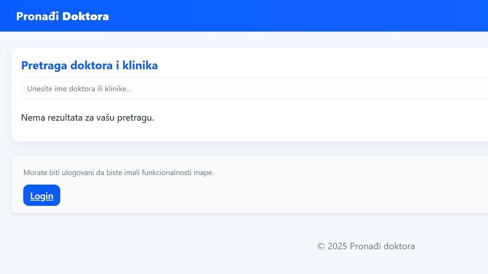
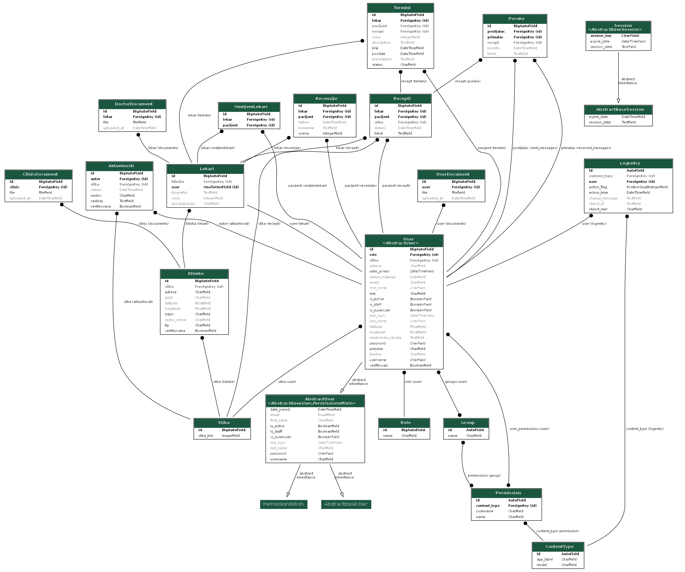

# Find a Doctor

A full-stack healthcare platform that helps patients discover doctors and clinics, review detailed profiles, manage appointments, and communicate with medical professionals. The application also provides dedicated workflows for doctors and administrators.



## Key Features

- Search doctors and clinics by name, specialization, and location
- View public doctor profiles, clinic information, availability, and pricing
- Patient and doctor registration with email account activation
- Role-based access for patients, doctors, and administrators
- Appointment scheduling and appointment-status management
- Favorite doctors and patient reviews
- Real-time user messaging implemented with Django Channels and WebSockets
- Prescription creation and exchange through the chat workflow
- Doctor and clinic document uploads with administrative verification
- Medical news publishing and moderation
- Location-aware functionality using geocoding and distance calculation

## Technology Stack

- **Backend:** Python, Django
- **Database:** MySQL
- **Real-time communication:** Django Channels, WebSockets, Redis
- **Background tasks:** Celery
- **Frontend:** Django Templates, HTML, CSS, JavaScript
- **Geolocation:** Geopy
- **Testing:** Django TestCase, Selenium

## Data Model

The application uses a custom user model and connected entities for doctors, clinics, appointments, reviews, messages, prescriptions, uploaded documents, and news.



## Local Setup

### 1. Clone the repository

```bash
git clone https://github.com/matejaplazinic/Find-a-Doctor.git
cd Find-a-Doctor
```

### 2. Create and activate a virtual environment

Windows:

```bash
python -m venv .venv
.venv\Scripts\activate
```

Linux/macOS:

```bash
python3 -m venv .venv
source .venv/bin/activate
```

### 3. Install dependencies

```bash
pip install -r requirements.txt
```

### 4. Configure the database

Create a local MySQL database and configure Django's `DATABASES` setting with your local database name, user, password, host, and port. Do not commit database credentials or other secrets to Git.

Redis is required when using the WebSocket channel layer outside the test configuration.

### 5. Apply migrations and start the server

```bash
python manage.py migrate
python manage.py runserver
```

Open [http://localhost:8000](http://localhost:8000) in your browser.

## Running Tests

Run the Django test suite with:

```bash
python manage.py test
```

The repository also contains Selenium-based browser tests for authentication, doctor registration, search, maps, reviews, and profile updates.

## Project Structure

```text
adm/                 Authentication and administration workflows
aktulenosti/         Medical news and announcements
chat/                Real-time messaging and prescriptions
doktor/              Core domain models and doctor functionality
pacijent/            Patient profiles, search, favorites, and reviews
pocetna/             Landing page
projekat_doktori/    Django project configuration
static/              CSS, JavaScript, and static assets
templates/           Django HTML templates
```

## Author

**Mateja Plazinić** — [GitHub](https://github.com/matejaplazinic)
